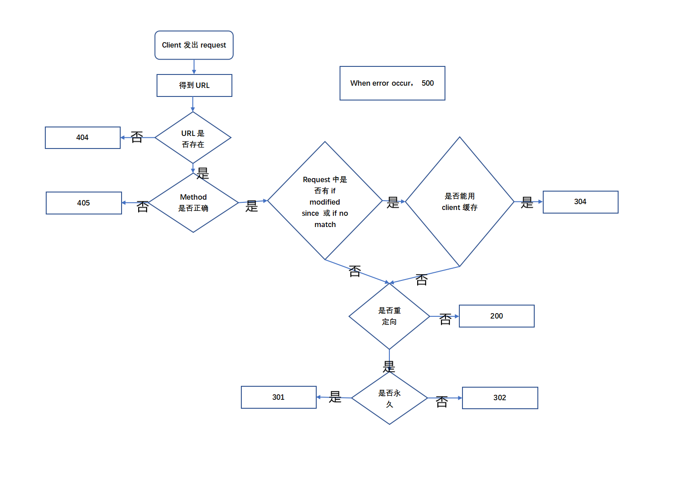

# 提醒

## 务必更改前pull，更改后push！

## 除非知道自己更改的是什么，否则merge时一律accept theirs，以远端为准！

## 请在commit message中简单写明更改的目的！

---

# 任务要求

## 基于Java Socket API搭建简单的HTTP客户端和服务器端程序

> Good luck and have fun!

## 说明：

### 1. 不允许基于netty等框架，完全基于Java Socket API进行编写

### 2. 不分区使用的IO模型，BIO、NIO和AIO都可以

### 3. 实现基础的HTTP请求、响应功能，具体要求如下：

    1. HTTP客户端可以发送请求报文、呈现响应报文（命令行和GUI都可以）

    2. HTTP客户端对301、302、304的状态码做相应的处理

    3. HTTP服务器端支持GET和POST请求

    4. HTTP服务器端支持200、301、302、304、404、405、500的状态码

    5. HTTP服务器端实现长连接

    6. MIME至少支持三种类型，包含一种非文本类型

### 4．基于以上的要求，实现注册，登录功能(数据无需持久化，存在内存中即可，只需要实现注册和登录的接口，可以使用postman等方法模拟请求发送，无需客户端)。

---

# 具体实现

## 1 请求报文、响应报文的实现

**见Message包里的Request类和Response类**

## 2 服务器

**HttpServer类通过静态方法start()实例化一个ServerSocket监听指定端口(default:8080)
，每当收到一个连接请求，将该次请求封装成一个HttpTask对象，实现Runnable接口多线程，以支持同时有多个http请求**

## 3 客户端

### 1 GET方法用于获取服务器目录下的资源，url为相对路径

### 2 POST方法用于向服务器提交数据，在本项目中仅实现提交账号密码，与注册登陆有关

## 4 状态码

## 5 资源管理

**sever的资源在HttpSever/webRoot目录下，各资源状态用json文件保存**
**client的缓存在HttpClient/cache下,也用json文件保存状态**

## 6 长连接

## 7 MIME类型

## 8 登陆的实现

---

# 参考资料

**https://www.cnblogs.com/chris-cp/p/5082514.html**
**https://blog.csdn.net/YaoLang1995/article/details/89316912**

*

*https://blog.csdn.net/linhao_obj/article/details/120767149?spm=1001.2101.3001.6650.2&utm_medium=distribute.pc_relevant.none-task-blog-2%7Edefault%7EBlogCommendFromBaidu%7ERate-2-120767149-blog-89316912.pc_relevant_3mothn_strategy_recovery&depth_1-utm_source=distribute.pc_relevant.none-task-blog-2%7Edefault%7EBlogCommendFromBaidu%7ERate-2-120767149-blog-89316912.pc_relevant_3mothn_strategy_recovery&utm_relevant_index=3
**
**https://blog.csdn.net/weixin_42316952/article/details/114081588**
**https://developer.mozilla.org/zh-CN/docs/Web/HTTP**
**https://zhuanlan.zhihu.com/p/388270712**
**https://blog.csdn.net/qq_34375473/article/details/122162682**

